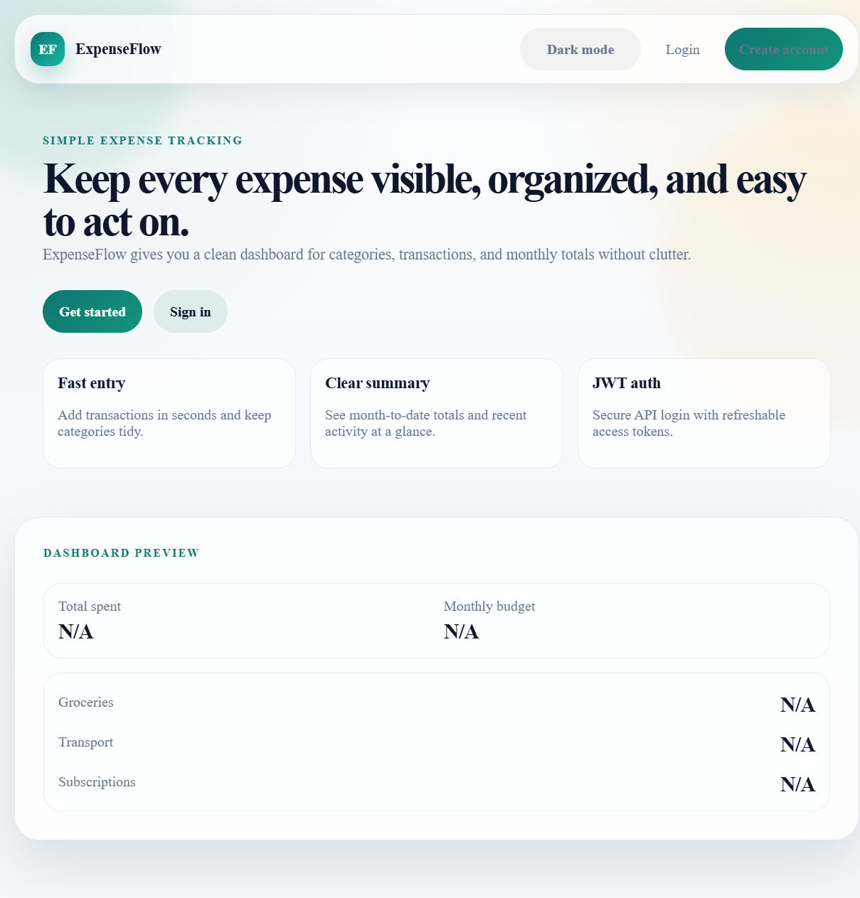
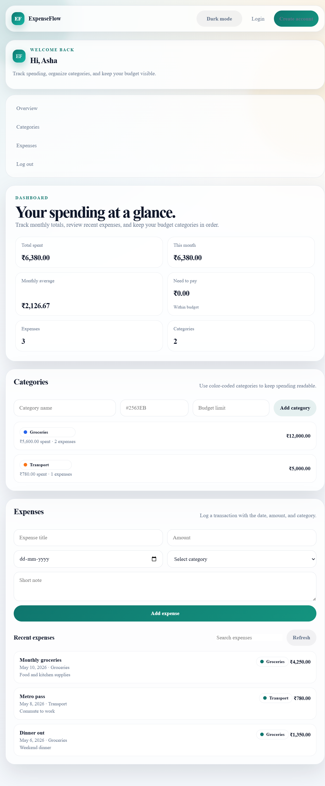
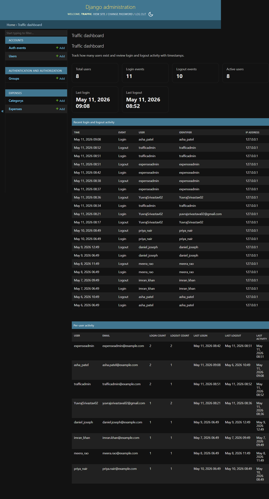

# BudgetFlow

BudgetFlow is a Django-based personal finance tracker for logging expenses, managing categories, and reviewing spending from a browser dashboard or REST API. It uses JWT authentication, a custom user model, and an admin traffic dashboard for monitoring login and logout activity.

Repository: [BudgetFlow](https://github.com/YUVRAJDEVESHSRIVASTAVA/BudgetFlow)

## Highlights

- Register and log in with JWT-backed authentication.
- Create user-owned categories and expenses.
- Review spending summaries in the dashboard.
- Monitor login, logout, and per-user activity in Django admin.
- Seed demo users, categories, expenses, and auth events for testing.

## Screenshots

<table>
	<tr>
		<td></td>
		<td></td>
		<td></td>
	</tr>
</table>

The screenshots above were captured from the running app and included in the repository so the GitHub page feels more complete.

## Tech Stack

- Django 5.2
- Django REST Framework
- SimpleJWT
- SQLite
- HTML, CSS, JavaScript

## Local Setup

```powershell
cd backend
python -m venv .venv
.venv\\Scripts\\Activate.ps1
pip install -r requirements.txt
python manage.py migrate
python manage.py seed_demo_data
python manage.py runserver
```

Open the app at http://127.0.0.1:8000/

## Demo Data

Run `python manage.py seed_demo_data` to create:

- 5 demo users with categories and expenses
- 1 admin account for checking traffic and auth events

The command prints the credentials in the terminal after it finishes.

## Pages

- `/` landing page
- `/login/` login page
- `/register/` registration page
- `/dashboard/` expense dashboard
- `/admin/` Django admin
- `/admin/traffic/` traffic dashboard

## API Endpoints

- `POST /api/auth/register/`
- `POST /api/auth/login/`
- `POST /api/auth/logout/`
- `POST /api/auth/refresh/`
- `GET /api/auth/me/`
- `GET|POST /api/categories/`
- `GET|POST /api/expenses/`
- `GET /api/summary/`

## Project Layout

- `backend/` Django project, apps, and database
- `frontend/` templates, styles, and browser scripts
- `database/` SQL schema and sample data files
- `docs/` API notes and supporting documentation

## Notes

- The project uses a custom Django user model.
- Auth events are stored in the `AuthEvent` table and surfaced in Django admin.
- Demo data can be recreated at any time with `python manage.py seed_demo_data`.
